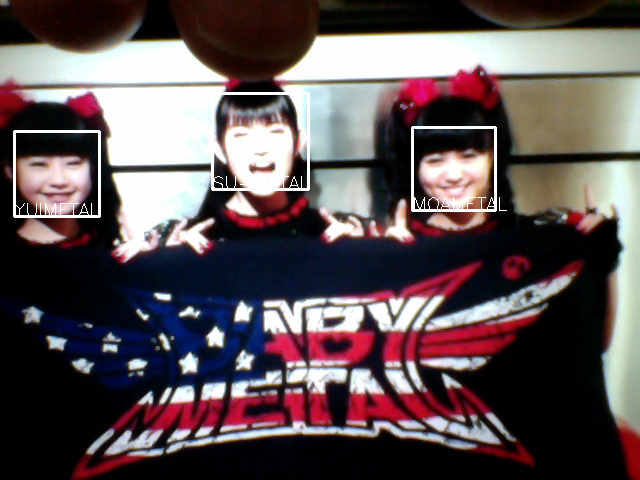

# BABYMETAL DETECTOR

「BABYMETAL の見分けが付かない」と言う声を聴いたので判別機を作ってみました。

BABYMETAL の画像を見せると顔認識をして、 誰か判れば白枠で囲んで名前を表示し、判らなければ青枠で囲みます。


# 動作例



スマホで Youtube を再生して、それを手で持って Macbook Air のカメラで撮影し、映った画像から顔認識しています。画像の上に見えているのはスマホを持っている指です。


# 作成環境

* Macbook Air
 * OS X El Capitan
* Python 3.5
* Anaconda
* TensorFlow
* Keras


# 環境の構築

動作に必要なものをインストールします。

```
conda create -n venv python=3.5
source activate venv
conda install -c https://conda.anaconda.org/menpo opencv3
conda install -c conda-forge tensorflow
pip install -r requirements.txt
```

Keras のバックエンドを TensorFlow に指定してください。


```json:keras.json
{
	"image_dim_ordering": "th",
	"epsilon": 1e-07,
	"floatx": "float32",
	"backend": "tensorflow"
}
```


# 学習

まず、顔を学習させます。

1. ./data/0/, ..., ./data/3/ ディレクトリへ画像を配置します。
 1. 数字のディレクトリがクラスインデックスを表します。
1. 0 から順に、SU-METAL、 YUIMETAL、 MOAMETAL、その他、の顔を配置してください。
 1. 画像は自分で集めましょう :)
 1. 学習時に 64x64 にリサイズするのでこのサイズだと効率的です
1. 以下のコマンドで学習を始めます。

```
$ python train.py
```


## 学習がめんどくさい人向け

[こちらに学習済みモデルを置いておきます。](https://www.dropbox.com/sh/t9av8wvka5dcf3k/AAArCmVizycAaBm-oAe-3Htia?dl=0)
すぐに動かしてみたい人はこれを ./store/model.h5 に配置すればすぐに使えます。

「もう少し精度を上げたい」とか、「神バンドも認識させたい」と言う場合は自分で学習させましょう。


# 実行

次に実行方法です。

```
$ python camera_reader.py
```

カメラが起動し、撮影した画像をウィンドウに表示します。
ここで、スマホや雑誌などで BABYMETAL の画像を見せれば名前を表示します。


# 動作説明

OpenCV で顔っぽい所を切り出して、ディープラーニングに投げて認識させています。


# ライセンス

[MIT](./LICENSE)


# 謝辞

このプログラムは、 Hironsan さんの [BossSensor](https://github.com/Hironsan/BossSensor) を元にしています。

